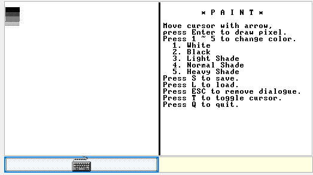

# n2tPaint
Paint made with Jack language (Nand2Tetris), 32x32 drawing space, 5 patterns, and save/load system!

# Screenshot

The screenshot is quite self-explanatory.

# Save/load system
So this paint supports save/load system.
It is done by string of ~512 characters, composited with numbers and characters (A to X).
