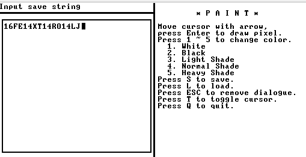

# n2tPaint
Paint made with Jack language (Nand2Tetris), 32x32 drawing space, 5 patterns, and save/load system!

# Screenshot

The screenshot is quite self-explanatory. Also you can see 5 patterns mentioned earlier (including trivial white) here.

# Save/load system
So this paint supports save/load system.

It is done by string of ~512 characters, composited with numbers and characters (A to Y, Y used for compression).

Image shows example of save string. (It is save string of first screenshot image.)

You can load image by input save string into load screen.
Once you enter save string and press enter. string is decrypted and loaded into paint.

# Classes

Five classes are used to make this happened.

 - Cell
   - Represents each cell - it contains pattern / selected state.
 - Paint
   - Take cares of everything about painting.
 - Dialogue
   - Makes 256x256 dialogue at the left of the screen.
 - InputBox
   - Universial input box (can be placed anywhere). Used in Dialogue.
   - Doesn't used `Keyboard.readLine`, but it supports simillar functionallity (Backspace support).
   - Inputting ESC will cancels input.
  - Main
    - Handels UI and user input.
